# ⚡ Energy Consumption Prediction — Week 3

**Dimensionality Reduction with PCA & Deployment via FastAPI**

A machine learning pipeline that predicts industrial energy consumption
(`Usage_kWh`) from operational sensor data. This week extends the Week 2
baseline model comparison with **PCA-based dimensionality reduction** and
deploys the final pipeline as an interactive **FastAPI web dashboard** with
real-time prediction.

---

## 📌 Project Overview

| | |
|---|---|
| **Dataset** | Steel industry energy consumption data (35,040 records, 10 raw features) |
| **Target variable** | `Usage_kWh` — energy consumption in kilowatt-hours |
| **Week 2 Best Model** | Random Forest Regressor (selected via 5-fold cross-validation) |
| **Dimensionality Reduction** | PCA — 27 one-hot encoded features → 19 components (95% variance retained) |
| **Deployment** | FastAPI + Jinja2 web app with a live prediction form and EDA dashboard |
| **Submission Deadline** | Saturday, 18 July 2026 |

---

## 🗂️ Table of Contents

- [Part 1 — PCA Dimensionality Reduction](#-part-1--pca-dimensionality-reduction)
- [Part 2 — FastAPI Dashboard](#-part-2--fastapi-dashboard)
- [Project Structure](#-project-structure)
- [Setup & Installation](#-setup--installation)
- [Running the App](#-running-the-app)
- [Screenshots](#-screenshots)
- [Tech Stack](#-tech-stack)
- [Key Learnings](#-key-learnings)
- [Notes & Caveats](#-notes--caveats)

---

## 🧪 Part 1 — PCA Dimensionality Reduction

Notebook: [`notebook/week3_pca.ipynb`](notebook/week3_pca.ipynb)

### Pipeline

1. **Load** the Week 2 preprocessed dataset — same features, same one-hot encoding
   (`WeekStatus`, `Day_of_week`, `Load_Type`, `Month`).
2. **Split first, then scale/reduce.** The dataset is split into train/test
   (80/20, `random_state=42` — identical to Week 2) *before* any scaling or PCA
   is applied. `StandardScaler` and `PCA` are fit on the training set only, then
   used to transform both sets. This avoids data leakage, a common pitfall when
   combining PCA with train/test evaluation.
3. **Full-spectrum PCA.** PCA is first applied with `n_components` equal to the
   total number of encoded features (27), purely to analyze how variance is
   distributed across all possible components.
4. **Scree plot** — bar chart of explained variance ratio per component.
5. **Cumulative variance curve** — with a horizontal reference line at 95%,
   identifying that **19 of 27 components** are needed to cross that threshold.
6. **Retrain the Week 2 best model** (Random Forest, confirmed as the
   cross-validation winner — CV RMSE 1.34 vs. 2.09 for Decision Tree and ~10.07
   for both linear models) using only **3 PCA components**.
7. **Retrain again** using the **19 components** that capture 95% of variance.
8. **Compare RMSE and R²** across all three configurations.
9. **PCA loading heatmap** — shows which original features contribute most to
   the first three principal components.
10. **Written report** — analysis of the accuracy/dimensionality trade-off and
    a recommendation on using PCA for memory-constrained deployment.

### Results

| Approach | RMSE | R² Score |
|---|---|---|
| Week 2 — Original (27 features) | **0.86** | **0.999** |
| PCA — 3 components | 11.08 | 0.892 |
| PCA — 95% variance (19 components) | 5.44 | 0.974 |

**Key takeaway:** Reducing to 19 components (a ~30% cut in feature count) keeps
R² above 0.97 — a reasonable trade-off if deployment hardware is memory- or
compute-constrained. Compressing further to just 3 components sacrifices too
much accuracy (R² drops to 0.89) to be worth the savings in most real-world
scenarios. The original 27-feature Random Forest model remains the most
accurate option and is the recommended default when resources allow it.

### PCA & Model Evaluation Visuals

<table>
<tr>
<td width="50%">

**Scree Plot**
<br>Explained variance ratio per individual component.
<br>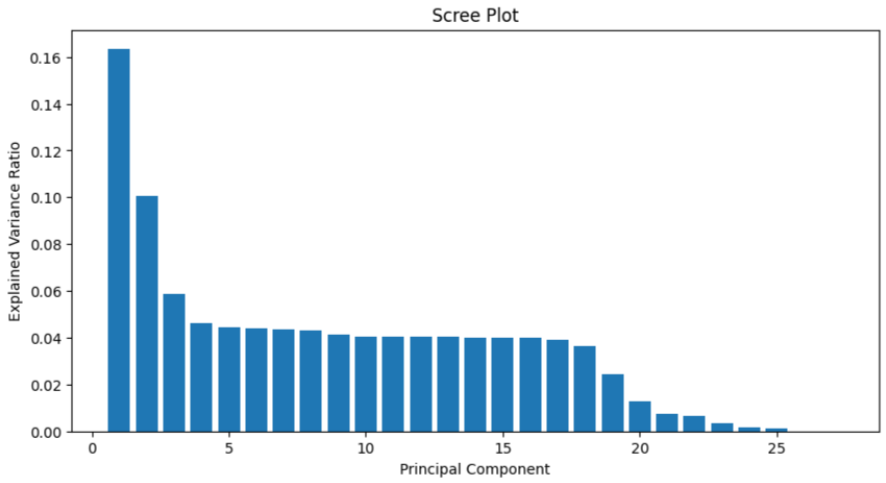

</td>
<td width="50%">

**Cumulative Explained Variance**
<br>95% threshold reached at 19 components.
<br>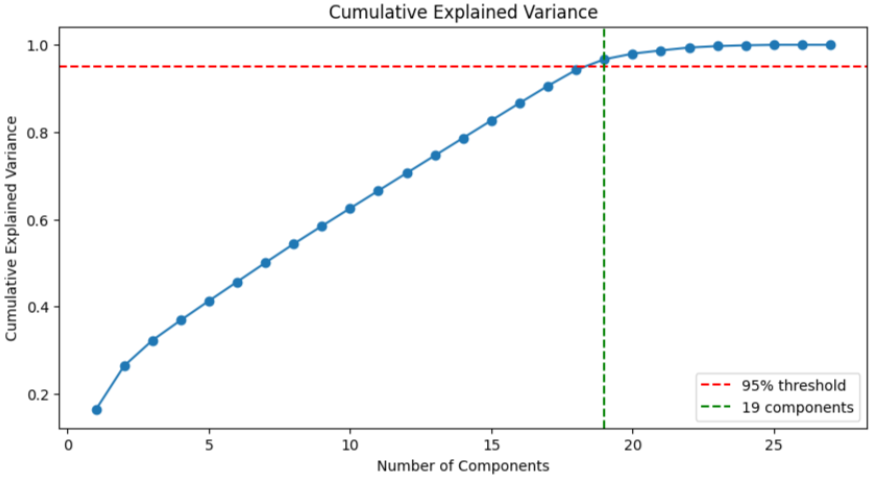

</td>
</tr>
<tr>
<td width="50%">

**PCA Loading Heatmap**
<br>Original feature contributions to PC1–PC3.
<br>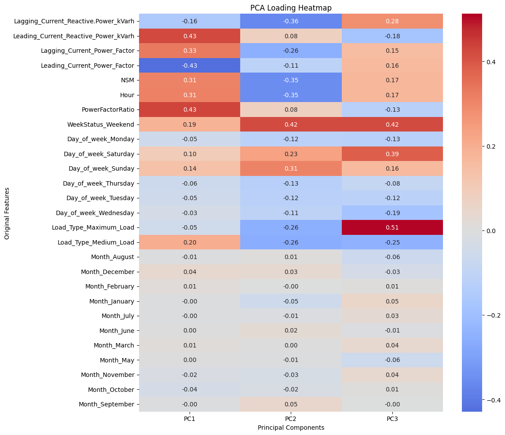

</td>
<td width="50%">

**Actual vs. Predicted**
<br>Model predictions vs. true energy usage on the test set.
<br>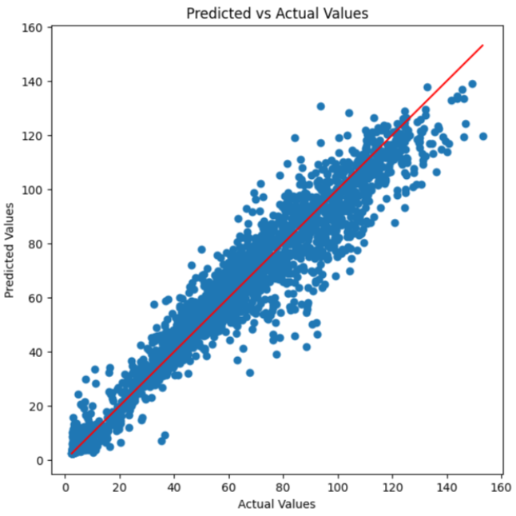

</td>
</tr>
<tr>
<td width="50%">

**Cross-Validation Results (Week 2)**
<br>5-fold CV RMSE across all four candidate models.
<br>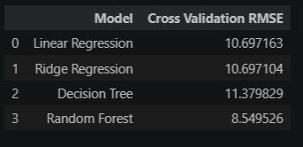

</td>
<td width="50%">

**Model Performance Summary**
<br>RMSE / R² for the final trained pipeline.
<br>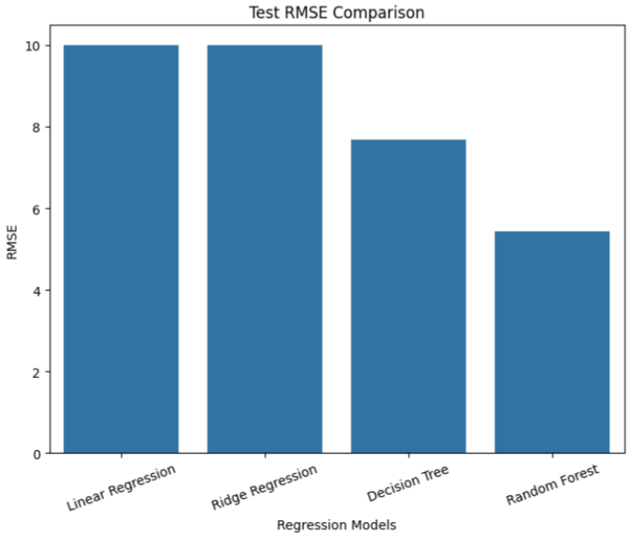

</td>
</tr>
<tr>
<td width="50%">

**RMSE / R² Comparison**
<br>Original model vs. 3-component PCA vs. 95%-variance PCA.
<br>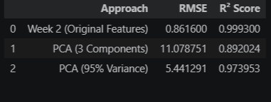

</td>
<td width="50%">

**Retrained Models — 95% Variance PCA**
<br>All four candidate models retrained on the 19-component PCA data.
<br>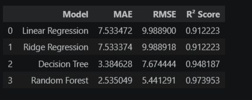

</td>
</tr>
</table>

---

## 🖥️ Part 2 — FastAPI Dashboard

### Routes

| Route | Method | Description |
|---|---|---|
| `/` | GET | Landing page — project overview, key stats, navigation |
| `/dashboard` | GET | Week 2 EDA visualizations (energy by hour, by load type, correlation heatmap) |
| `/predict` | GET | Prediction form |
| `/predict` | POST | Accepts operating conditions, returns predicted `Usage_kWh` on the same page |

### How prediction works

The `/predict` form collects **raw, human-readable operating conditions**
(power factor readings, hour of day, load type, etc.) rather than PCA
components, since asking a user to manually enter 19 abstract PCA values
would be meaningless. On submit, the backend reproduces the exact training
pipeline:

```
Raw form inputs
     │
     ▼
One-hot encode categorical fields (aligned to training column order)
     │
     ▼
StandardScaler.transform()
     │
     ▼
PCA.transform()   → 19 components
     │
     ▼
RandomForestRegressor.predict()
     │
     ▼
Predicted Usage_kWh returned to the page
```

This guarantees the exact same preprocessing steps used during training are
applied at inference time — the saved `scaler.joblib` and `pca.joblib` are
loaded once at app startup and reused for every request.

---

## 📁 Project Structure

```
.
├── app/
│   ├── main.py                    # FastAPI app: routes, model loading, prediction logic
│   ├── templates/                 # Jinja2 HTML templates
│   │   ├── base.html              # Shared layout + navigation bar
│   │   ├── index.html             # Home page ("/")
│   │   ├── dashboard.html         # EDA visualizations ("/dashboard")
│   │   └── predict.html           # Prediction form + result ("/predict")
│   └── static/
│       ├── style.css              # App styling
│       ├── energy_by_hour.png     # Generated EDA chart
│       ├── energy_by_load_type.png# Generated EDA chart
│       └── correlation_heatmap.png# Generated EDA chart
│
├── data/
│   └── engineered_energy_dataset.csv
│
├── models/
│   ├── best_model.joblib          # Trained Random Forest (final pipeline model)
│   ├── scaler.joblib               # Fitted StandardScaler (train-only fit)
│   ├── pca.joblib                  # Fitted PCA, 95% variance (19 components)
│   └── feature_metadata.json       # Encoded column order + categorical dropdown options
│
├── notebook/
│   └── week3_pca.ipynb            # Full PCA analysis + Dimensionality Reduction Report
│
├── screenshots/                    # App and analysis screenshots (see below)
│
├── requirements.txt
└── README.md
└──generate_eda_plots.py
```

---

## ⚙️ Setup & Installation

**1. Clone the repository**
```bash
git clone <your-repo-url>
cd <your-repo-folder>
```

**2. Install dependencies**
```bash
pip install -r requirements.txt
```
or, if `pip` isn't recognized on your system:
```bash
python -m pip install -r requirements.txt
```

**Dependencies include:** `fastapi`, `uvicorn`, `jinja2`, `python-multipart`,
`joblib`, `pandas`, `numpy`, `scikit-learn`, `matplotlib`, `seaborn`.

---

## 🚀 Running the App

**1. Start the server** — run this from the project root (the folder that
*contains* `app/`, not from inside it):
```bash
uvicorn app.main:app --reload
```

**2. Open your browser and go to:**
```
http://127.0.0.1:8000
```

**3. Confirm all routes work:**
- `/` — home page loads with working navigation
- `/dashboard` — all 3 EDA charts render correctly
- `/predict` — form displays a field for every model input
- Submitting the form returns a live predicted `Usage_kWh` value

To stop the server, press `Ctrl+C` in the terminal.

---

## 📸 Screenshots

<table>
<tr>
<td width="33%">

**Home Page**
<br>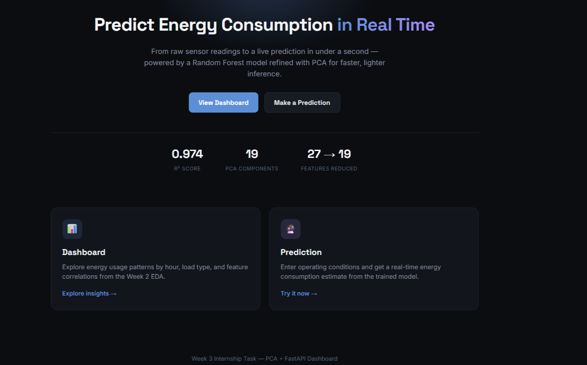

</td>
<td width="33%">

**Dashboard Page**
<br>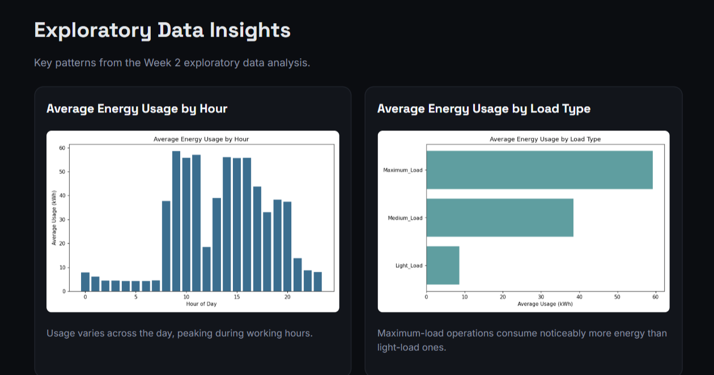

</td>
<td width="33%">

**Correlation Heatmap**
<br>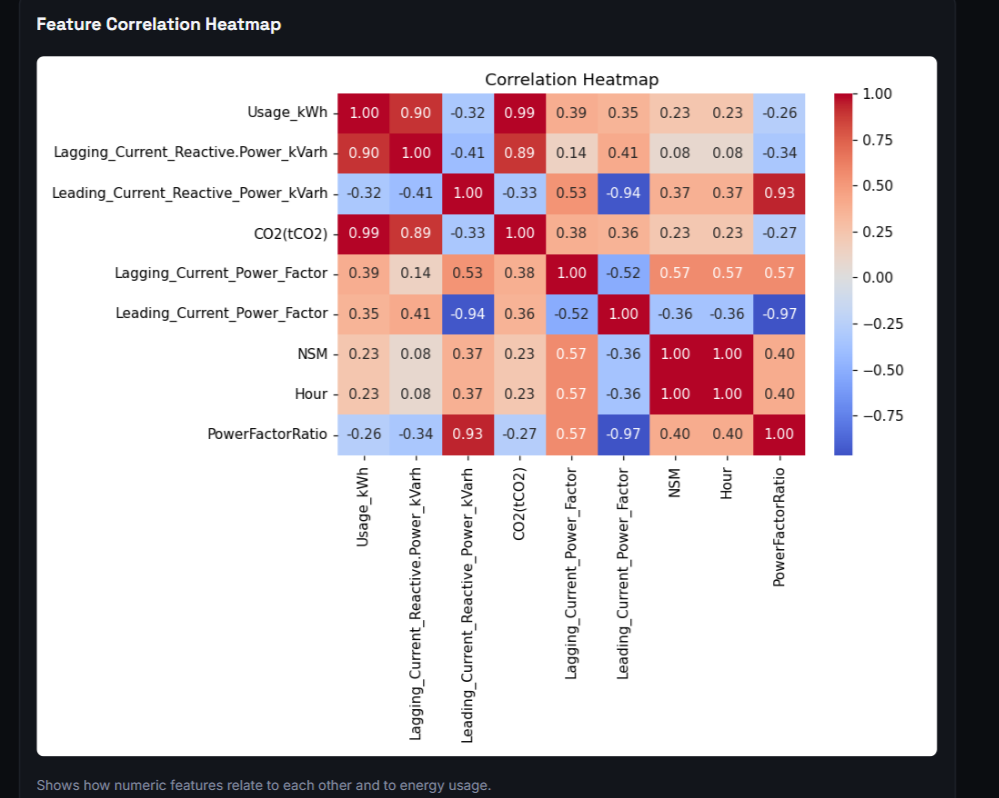

</td>
</tr>
</table>

**Live Prediction Result**

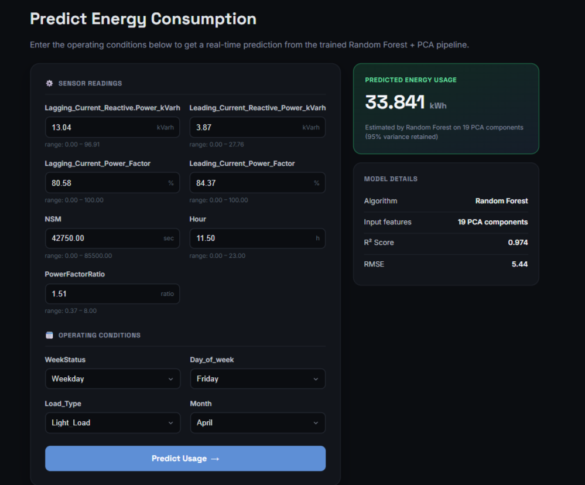

---

## 🛠️ Tech Stack

| Category | Tools |
|---|---|
| **Modeling** | scikit-learn — `RandomForestRegressor`, `PCA`, `StandardScaler` |
| **Backend** | FastAPI, Uvicorn |
| **Templating** | Jinja2 |
| **Data & Visualization** | pandas, numpy, matplotlib, seaborn |
| **Persistence** | joblib |
| **Frontend** | HTML, CSS (no framework — kept intentionally lightweight) |

---

## 🎓 Key Learnings

- **Data leakage is easy to introduce silently.** Fitting a scaler or PCA on
  the full dataset before splitting inflates test performance in a way that's
  easy to miss — the correct order is always split → fit-on-train →
  transform-both.
- **PCA trades interpretability and accuracy for compactness.** Explained
  variance (95%) is not the same as retained predictive power — the loading
  heatmap showed some encoded features (e.g. `Month_*` dummies) contributed
  almost nothing to the first components, while power-factor and load-type
  features dominated.
- **Deploying a PCA-based model requires care.** The scaler, PCA transform,
  and model must be applied in the exact same order and with the exact same
  fitted parameters used during training — any mismatch silently produces
  wrong predictions rather than an error.

---

## 📝 Notes & Caveats

- The `StandardScaler` and `PCA` objects are fit **only on the training
  set** — this is intentional and required to prevent data leakage.
- `feature_metadata.json` (in `models/`) is not one of the task's listed
  deliverables, but is required for the `/predict` form to dynamically
  generate the correct input fields and to correctly reconstruct the
  one-hot-encoded feature vector at inference time.
- Model metrics (RMSE / R²) will vary slightly run-to-run depending on the
  installed versions of `scikit-learn` and `numpy` — the values reported
  above were generated with the versions pinned in `requirements.txt`.

---

*Week 3 Internship Task — Dimensionality Reduction & FastAPI Dashboard*